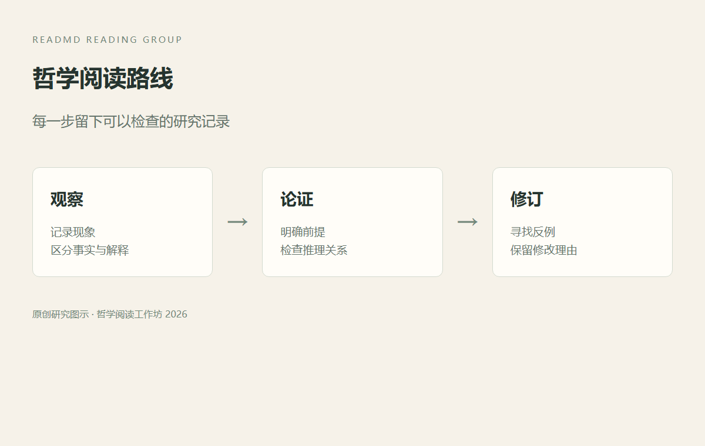

# 哲学阅读研究手册

把问题写清楚，把论证留下来。本文是为 ReadMD 操作演示编写的原创研究资料。

## 一 认识与经验

一个判断的可靠性来自什么？我们用**观察记录**与*推理过程*区分证据和结论。

> [!NOTE]
> 这里的例子用于练习论证分析，不代表对某位哲学家的原文转述。

阅读 [[认识与经验]]，并与 [[自由与责任]] 对照。

| 研究问题 | 可检查的材料 | 下一步 |
| :--- | :--- | :--- |
| 经验是否足够 | 观察笔记 | 寻找反例 |
| 行动是否自由 | 选择情境 | 区分限制 |
| 判断如何成立 | 前提与结论 | 检查推理 |

## 二 论证与反例

如果每个观察样本都符合命题，命题是否一定成立？[^sample]

$P(H \mid E)=\frac{P(E \mid H)P(H)}{P(E)}$

- [x] 明确研究问题
- [ ] 比较不同解释
- [ ] 整理参考文献

```javascript
const observations = [3, 5, 8, 13];
console.log(observations.reduce((a, b) => a + b, 0));
```

## 三 讨论记录



我们先保留原稿，再尝试改写，最后核对修改内容。参见 [研究方法](notes/研究方法.md)。

[^sample]: 有限样本支持推断，但需要说明适用范围。
